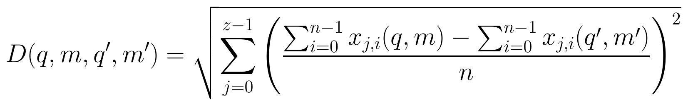

# Math Images from Documents

Generate PNG images from math equations in LaTeX/TeX and Markdown documents. Built in Rust, designed for AI agents.

 

## Quick Start

This tool ships as an [OpenClaw](https://github.com/openclaw/openclaw) skill. Install it by telling your AI agent:

> Read https://raw.githubusercontent.com/juntao/math-images-skill/main/install.md and follow the instructions.

Once installed, send your agent a LaTeX or Markdown file and ask it to create images for the math equations. It will extract each equation, render it as a PNG image, and send the images back.

### Notes

- The OpenClaw agent skill uses `math2img` (pure Rust) exclusively — it requires no external dependencies and works out of the box. If you need publication-quality rendering with full LaTeX fidelity, you can switch to use `math2img-tectonic` manually as a standalone CLI tool (see [Two Rendering Backends](#two-rendering-backends) below).

- **Switching to `math2img-tectonic` as the default:** Both binaries are installed by the bootstrap script. If you have `tectonic` and `pdftoppm` installed and want the agent to always use the Tectonic backend, simply swap the binary:

  ```bash
  cd ~/.openclaw/skills/math-images/scripts
  mv math2img math2img-pure
  mv math2img-tectonic math2img
  ```

  This makes the agent use the Tectonic backend transparently — no other configuration changes needed. To revert, swap them back.

## What It Does

Give it a LaTeX or Markdown file containing math equations:

```latex
The famous equation $E = mc^2$ appears inline.

Display math:
$$\frac{d}{dx} \int_a^x f(t)\,dt = f(x)$$

A matrix:
\begin{pmatrix}
a & b \\
c & d
\end{pmatrix}
```

Get back publication-quality PNG images for each equation — ready to embed in blog posts, presentations, chat messages, or anywhere that doesn't support LaTeX rendering natively.

## Examples

Given the following LaTeX equations:

```latex
\begin{equation}
D(q, m, q', m') = \sqrt{\sum_{j=0}^{z-1} \left(\frac{\sum_{i=0}^{n-1} x_{j,i}(q,m) - \sum_{i=0}^{n-1} x_{j,i}(q',m')}{n}\right)^2}
\end{equation}
```



```latex
\begin{equation}
\sigma_j(q,m) = \sqrt{\frac{\sum_{i=0}^{n-1} \left(x_{j,i} - \frac{\sum_{i=0}^{n-1} x_{j,i}}{n}\right)^2}{n}}
\end{equation}
```


## Features

- **Single tool** — `math2img` extracts and renders all equations in one pass
- **LaTeX & Markdown** — Detects input format by file extension
- **Smart extraction** — Handles `$...$`, `$$...$$`, `\[...\]`, `\(...\)`, and environments (`equation`, `align`, `pmatrix`, `cases`, etc.)
- **Markdown-aware** — Skips math inside fenced code blocks and inline code
- **100+ LaTeX commands** — Greek letters, operators, fractions, square roots, matrices, subscripts, superscripts, arrows, accents, and more
- **Dark & light themes** — Dark (default) or light color scheme
- **STIX Two Math font** — Embedded font for consistent, high-quality rendering
- **Single binary** — No runtime dependencies, statically linked on Linux

## Two Rendering Backends

This project provides two tools with the same CLI interface but different rendering approaches:

### `math2img` — Pure Rust (default)

- **Zero runtime dependencies** — single static binary, nothing else needed
- **Fast** — renders 67 equations in ~0.15 seconds
- Renders math using the embedded STIX Two Math font and a custom layout engine
- Supports 100+ LaTeX commands covering common math notation
- Best for: AI agents, quick previews, environments where installing TeX is impractical

### `math2img-tectonic` — Tectonic TeX Engine

- **Publication-perfect rendering** — uses a real TeX engine (Tectonic/XeTeX) with Computer Modern fonts
- **Full LaTeX support** — anything that compiles in LaTeX works here, including `tikz`, custom packages, etc.
- Requires `tectonic` and `pdftoppm` (poppler) installed at runtime
- Slower (~12 seconds for 67 equations) since each equation compiles a full LaTeX document
- Best for: publications, archival quality, complex math that exceeds the pure Rust parser

Both tools share the same equation extraction logic and CLI interface (`-i`, `-o`, `--theme`, `--font-size`, `--scale`).

## Installation

### Pre-built Binaries

Download from [Releases](https://github.com/juntao/math-images-skill/releases/latest):

**math2img (pure Rust, no dependencies):**

| Platform | File |
|----------|------|
| Linux x86_64 (static) | `math-images-linux-x86_64.zip` |
| Linux aarch64 (static) | `math-images-linux-aarch64.zip` |
| macOS Intel | `math-images-darwin-x86_64.zip` |
| macOS Apple Silicon | `math-images-darwin-aarch64.zip` |
| Windows x86_64 | `math-images-windows-x86_64.zip` |

**math2img-tectonic (TeX quality, requires tectonic + pdftoppm):**

| Platform | File |
|----------|------|
| Linux x86_64 (static) | `math-images-tectonic-linux-x86_64.zip` |
| Linux aarch64 (static) | `math-images-tectonic-linux-aarch64.zip` |
| macOS Intel | `math-images-tectonic-darwin-x86_64.zip` |
| macOS Apple Silicon | `math-images-tectonic-darwin-aarch64.zip` |
| Windows x86_64 | `math-images-tectonic-windows-x86_64.zip` |

### Runtime Dependencies for math2img-tectonic

```bash
# macOS
brew install tectonic poppler

# Ubuntu/Debian
apt-get install tectonic poppler-utils

# Arch
pacman -S tectonic poppler
```

### Build from Source

```bash
# Pure Rust version
cd math2img
cargo build --release
# Binary at: target/release/math2img

# Tectonic version
cd math2img-tectonic
cargo build --release
# Binary at: target/release/math2img-tectonic
```

## Usage

```bash
# Basic usage (dark theme)
math2img -i document.tex -o output_dir/

# Light theme
math2img -i document.tex -o output_dir/ --theme light

# Markdown input
math2img -i document.md -o output_dir/

# Custom font size and scale
math2img -i document.tex -o output_dir/ --font-size 32 --scale 4.0
```

### Options

| Flag | Default | Description |
|------|---------|-------------|
| `-i` | (required) | Input file path (`.tex`, `.md`, `.markdown`, `.mdx`) |
| `-o` | (required) | Output directory for PNG images |
| `--theme` | `dark` | Color theme (`dark` or `light`) |
| `--font-size` | `24` | Base font size in pixels |
| `--scale` | `3.0` | Rendering scale factor |

### Output

Equations are numbered sequentially: `equation_0001.png`, `equation_0002.png`, etc.

### Supported LaTeX Constructs

| Category | Examples |
|----------|---------|
| Inline math | `$...$`, `\(...\)` |
| Display math | `$$...$$`, `\[...\]` |
| Environments | `equation`, `align`, `gather`, `multline`, `displaymath`, `eqnarray` (and `*` variants) |
| Matrices | `pmatrix`, `bmatrix`, `vmatrix`, `Bmatrix`, `Vmatrix`, `cases` |
| Fractions | `\frac{a}{b}` |
| Roots | `\sqrt{x}`, `\sqrt[n]{x}` |
| Scripts | `x^2`, `x_i`, `x_i^2` |
| Greek | `\alpha`, `\beta`, `\gamma`, `\Gamma`, `\pi`, `\Pi`, ... |
| Operators | `\sum`, `\prod`, `\int`, `\lim`, `\sin`, `\cos`, ... |
| Relations | `=`, `\neq`, `\leq`, `\geq`, `\approx`, `\equiv`, ... |
| Arrows | `\to`, `\leftarrow`, `\Rightarrow`, `\leftrightarrow`, ... |
| Delimiters | `\left(`, `\right)`, `\left[`, `\right]`, `\left\{`, `\right\}` |
| Accents | `\hat`, `\bar`, `\vec`, `\dot`, `\tilde`, `\overline` |
| Spacing | `\,`, `\;`, `\quad`, `\qquad` |

## License

MIT
